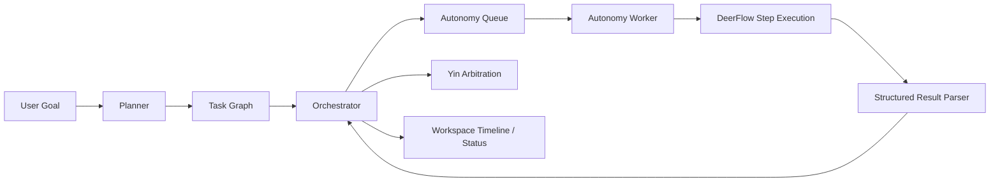
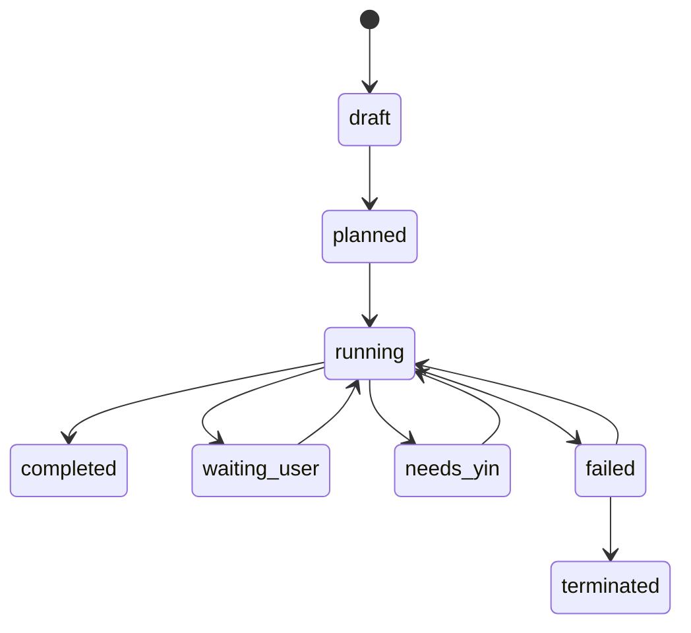

# Employee Collaboration Orchestration Engine

**Version:** v0.1  
**Date:** 2026-04-01  
**Status:** Draft

## 1. Goal

Design an employee collaboration orchestration engine for OpenSwarm so a created team can:

- analyze a user goal
- split the work into role-appropriate steps
- build dependencies between employees
- execute step handoff across the team
- escalate unclear situations to the command core for arbitration

This engine should be **semi-automatic and controllable**, not a black-box full-autonomy system.

---

## 2. Why This Engine Exists

Current OpenSwarm capabilities already support:

- team creation
- employee selection
- per-employee skills
- group discussion
- task creation from discussion
- single-employee execution through DeerFlow

What is still missing is the **organization layer**:

- who should go first
- who depends on whose output
- which tasks can run in parallel
- when a step is complete
- when to hand off to another employee
- when the system should stop and ask for arbitration

This engine upgrades OpenSwarm from a “multi-agent panel” into a “digital team operating system”.

---

## 3. Example Scenario

User asks for a research report. The team contains:

- lawyer
- crawler specialist
- writer
- data analyst

Expected collaboration:

1. crawler collects source materials
2. analyst extracts patterns and conclusions
3. writer produces the report draft
4. lawyer reviews compliance/risk issues
5. if blocked or ambiguous, command core decides next step

This is not just chat coordination. It is a structured dependency-driven workflow.

---

## 4. Scope Boundary

### The engine is responsible for

- task decomposition
- role matching
- dependency graph creation
- autonomous handoff
- run state management
- retry / reassign / escalate
- arbitration trigger conditions

### The engine is not responsible for

- replacing DeerFlow execution
- rendering all UI itself
- fully automatic irreversible decisions

**Architecture rule:**  
`OpenSwarm orchestrates, DeerFlow executes each step.`

---

## 5. High-Level Architecture



---

## 6. Core Components

## 6.1 Planner

The planner converts a user goal into a collaboration plan.

### Input

- user goal
- selected team employees
- employee roles
- employee allowed skills
- optional discussion summary

### Output

- step list
- recommended owner per step
- dependency edges
- parallelizable steps
- risk points that may need arbitration

### Example output

```json
{
  "steps": [
    {
      "id": "step_collect",
      "title": "Collect source material",
      "owner": "employee_crawler",
      "depends_on": [],
      "goal": "Gather recent public information and source links"
    },
    {
      "id": "step_analyze",
      "title": "Analyze collected material",
      "owner": "employee_analyst",
      "depends_on": ["step_collect"],
      "goal": "Extract patterns, metrics, and core findings"
    },
    {
      "id": "step_write",
      "title": "Draft research report",
      "owner": "employee_writer",
      "depends_on": ["step_analyze"],
      "goal": "Produce a readable structured report draft"
    },
    {
      "id": "step_legal_review",
      "title": "Review legal/compliance risks",
      "owner": "employee_lawyer",
      "depends_on": ["step_write"],
      "goal": "Review language and risk implications"
    }
  ]
}
```

---

## 6.2 Task Graph

The task graph is the source of truth for collaboration flow.

### Graph semantics

- node = one team step
- edge = dependency
- owner = assigned employee
- outputs = artifacts and summaries
- state = execution lifecycle

The graph allows OpenSwarm to express:

- serial steps
- parallel branches
- blocked transitions
- resumable execution

---

## 6.3 Orchestrator

The orchestrator is the state machine controller.

### Responsibilities

- find runnable steps
- enqueue execution
- evaluate returned results
- unlock dependent steps
- stop and escalate when ambiguity appears
- manage retries and reassignments

### Scheduling rules

- a step becomes runnable only when all dependencies are completed
- parallel steps may run concurrently
- every step has retry limits
- every run has max-step and max-handoff limits
- escalation happens before the system becomes chaotic

---

## 6.4 DeerFlow Step Executor

Each step still executes as a DeerFlow run.

The engine does **not** create a new execution runtime model. It wraps DeerFlow with stronger orchestration rules.

### Per-step execution flow

1. resolve step owner
2. build step context
3. pass upstream outputs and summaries
4. run DeerFlow for that employee
5. parse structured response
6. update run / step state

### Step prompt contract

Each employee should return:

1. a concise natural-language summary
2. a structured block describing the next orchestration action

Recommended format:

```text
<autonomy_result>
{"status":"handoff","artifacts":["workspace/output/report.md"],"handoff_to":"employee_writer","handoff_message":"Please turn the analysis into a final report draft.","needs_yin":false,"task_done":false}
</autonomy_result>
```

### Recommended status values

- `completed`
- `handoff`
- `blocked`
- `failed`

Auxiliary booleans:

- `needs_yin`
- `task_done`

---

## 6.5 Yin Arbitration

Arbitration should not be part of the default path. It should only activate when the run is blocked or ambiguous.

### Trigger conditions

- invalid `handoff_to`
- multiple plausible next owners
- step exceeded retry limit
- max handoff depth exceeded
- output incomplete or inconsistent
- missing critical input

### Arbitration outcomes

- continue with employee X
- ask user for clarification
- terminate run
- re-plan remaining steps

---

## 7. State Machine

## 7.1 Run states

- `draft`
- `planned`
- `running`
- `waiting_user`
- `needs_yin`
- `completed`
- `failed`
- `terminated`

## 7.2 Step states

- `queued`
- `ready`
- `running`
- `done`
- `handoff`
- `blocked`
- `failed`
- `skipped`

## 7.3 Run state flow



---

## 8. Data Model Proposal

The current `tasks` and `runtime_jobs` tables are not enough to express a relay chain. Add dedicated autonomy tables.

## 8.1 `autonomy_runs`

Represents one collaboration run.

Suggested fields:

- `id`
- `project_id`
- `source_discussion_id`
- `task_title`
- `goal`
- `initial_employee_id`
- `current_employee_id`
- `status`
- `participant_employee_ids` jsonb
- `planner_output` jsonb
- `created_at`
- `updated_at`

## 8.2 `autonomy_steps`

Represents one baton step.

Suggested fields:

- `id`
- `run_id`
- `step_key`
- `title`
- `owner_employee_id`
- `depends_on` jsonb
- `status`
- `goal`
- `input_context` jsonb
- `output_summary`
- `artifacts` jsonb
- `handoff_to`
- `handoff_message`
- `runtime_job_id`
- `started_at`
- `finished_at`

## 8.3 `autonomy_events`

Represents the timeline / audit stream.

Suggested fields:

- `id`
- `run_id`
- `step_id`
- `type`
- `agent_id`
- `message`
- `metadata` jsonb
- `created_at`

Suggested event types:

- `run_started`
- `plan_generated`
- `step_started`
- `step_completed`
- `handoff`
- `retry`
- `reassign`
- `needs_yin`
- `waiting_user`
- `terminated`

---

## 9. API Design Proposal

## 9.1 Start a run

`POST /api/autonomy/task-runs`

```json
{
  "projectId": "proj_xxx",
  "goal": "完成一份调研报告",
  "initialEmployeeId": "employee_crawler",
  "participantEmployeeIds": [
    "employee_crawler",
    "employee_analyst",
    "employee_writer",
    "employee_lawyer"
  ],
  "sourceDiscussionId": "disc_xxx"
}
```

## 9.2 Get one run

`GET /api/autonomy/task-runs/:runId`

## 9.3 List runs for a project

`GET /api/autonomy/task-runs?projectId=proj_xxx`

## 9.4 Retry a step

`POST /api/autonomy/task-runs/:runId/retry-step`

## 9.5 Reassign a step

`POST /api/autonomy/task-runs/:runId/reassign-step`

## 9.6 Trigger Yin review

`POST /api/autonomy/task-runs/:runId/yin-review`

## 9.7 Terminate a run

`POST /api/autonomy/task-runs/:runId/terminate`

---

## 10. Worker Design

Current OpenSwarm already has:

- discussion worker
- task worker
- BullMQ queues
- DeerFlow execution adapter

The engine should add:

- `queueNames.autonomy`
- `AutonomyRunJob`
- `AutonomyStepJob`
- `processAutonomyStepJob`

### Step execution loop

1. load current run
2. find all `ready` steps
3. enqueue step execution
4. execute DeerFlow for the assigned employee
5. parse `autonomy_result`
6. update step and run status
7. unlock downstream steps
8. escalate if needed

---

## 11. How This Fits the Current OpenSwarm Stack

### Already available

- `projects`
- `employees`
- `employee_skills`
- `discussion_sessions`
- `tasks`
- `runtime_jobs`
- DeerFlow `allowed_skills`
- BullMQ queue + worker setup

### Needs to be added

- autonomy routes/module
- autonomy prisma tables
- planner service
- autonomy queue + worker
- structured result parser
- workspace timeline UI

---

## 12. MVP Rollout Plan

## Phase 1: Collaboration Planning

Goal:
- generate a step plan
- recommend owners
- show dependencies
- let user confirm before execution

Do not yet auto-run the chain.

This is the safest first version.

## Phase 2: Controlled Relay Execution

Goal:
- execute the confirmed graph automatically
- hand off from one employee to another
- stop on ambiguity
- allow retry and reassignment

This is the first real autonomy version.

## Phase 3: Yin Arbitration

Goal:
- when run enters `needs_yin`, ask command core to decide next action
- support continue / wait user / terminate / re-plan

This closes the loop.

---

## 13. Workspace UI Design

Recommended additions to the workspace:

- `∞ 自治接力` button
- relay setup panel
- run timeline
- current baton owner
- next suggested owner
- retry current step
- reassign next step
- request Yin arbitration

Do **not** build a full DAG editor in V1.  
Use:

- timeline
- step list
- dependency summary

That is enough for the first release.

---

## 14. Advantages

- team collaboration becomes real, not cosmetic
- result quality should improve for multi-role tasks
- task process becomes explainable
- fits enterprise knowledge work better than a single giant agent
- supports human intervention cleanly

---

## 15. Drawbacks

- much higher system complexity
- higher latency and higher token/tool cost
- stronger requirement for structured outputs
- harder debugging and observability
- more failure states to design carefully

---

## 16. Major Risks and Mitigations

## Risk 1: Planner produces poor decomposition

Mitigation:
- V1 requires user confirmation before full run

## Risk 2: Employees overstep role boundaries

Mitigation:
- strict role-boundary prompt
- explicit handoff rules

## Risk 3: Infinite relay chains

Mitigation:
- max run steps
- max handoffs per employee
- forced escalation after threshold

## Risk 4: Results are hard to trust

Mitigation:
- mandatory event timeline
- structured outputs
- explicit artifacts per step

---

## 17. Recommended Build Order

1. Prisma schema for autonomy tables
2. planner output contract
3. autonomy API routes
4. autonomy worker
5. DeerFlow autonomy prompt + parser
6. workspace autonomy UI
7. retry / reassign actions
8. Yin arbitration

---

## 18. Final Recommendation

This engine is worth building, but the correct first implementation is:

**a user-confirmable, semi-automatic collaboration orchestration engine**

Not:

**a fully automatic black-box autonomous organization**

The right sequence is:

1. system proposes plan
2. user confirms
3. system executes relay
4. command core handles ambiguity

That gives OpenSwarm a strong product differentiator without making V1 uncontrollable.
